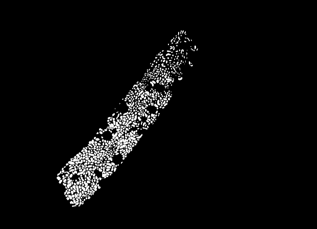
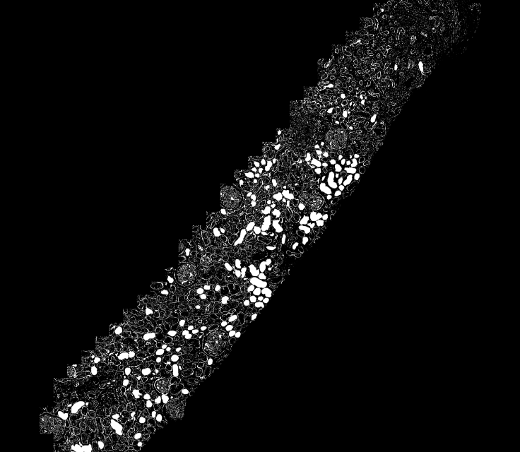
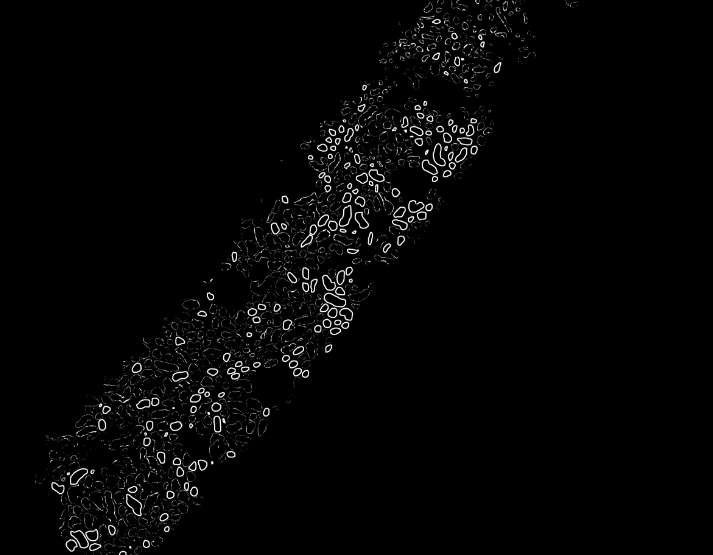

Name: Manoj Kumar Galla
# Post Processing Pipeline for TBM segmentation

# Clinical Application
TBM thickening is a significant indicator for kidney patients progressing from AKI to CKD. Using AI to detect TBM thickening can help aid in the early detection of this progression.

# Problem Statement
There is significant noise and irregularities in the TBMs predicted by models like
Resunet++. Without proper post processing techniques, the segmentation model
predictions alone might not be reliable.

# Methodology
1) Created a distance map using distance transforms of the binary mask of the tubules and also the inverse of the binary mask and applied a threshold to get a binary mask with expected tbm pixel occurences. 
2) Used this binary mask to filter out noise and irregularities from the binary mask of TBM image  

# Observations

Binary mask of tubules

Predicted Tbms before post processing

Predicted TBMS after post processing

# Instructions to Run the notebooks 
## Ensure you have the WSI images uploaded and adjust the file paths accordingly in the notebooks provided.

1. Run Split_WSI.ipynb notebook to split the original WSI images into small tiles.
2. Run test.ipynb to load the trained model and perform predictions on the tiles.
3. Run Save_annotations.ipynb to create an annotations file using the predicted masks.
4. Run filter_masks_.ipynb to load the binary masks of tubules and tbms to perform post processing techniques to filter out noise in the predicted TBMs.
5. Run split_filtered_images.ipynb to split the filtered large png images into small tiles.
6. Run Save_annotations.ipynb again to save the annotations of the filtered binary masks.

# Instructions to Run the Pipeline
## Edit the tbm_config file with appropriate paths and parameters
Run TBM_pipeline.py with correct config file name

# References

[Image processing notebooks](https://github.com/adfoucart/image-processing-notebooks/blob/main/V32%20-%20Distance%20Transform.ipynb)
[Open cv](https://docs.opencv.org/3.4/d4/d73/tutorial_py_contours_begin.html)
